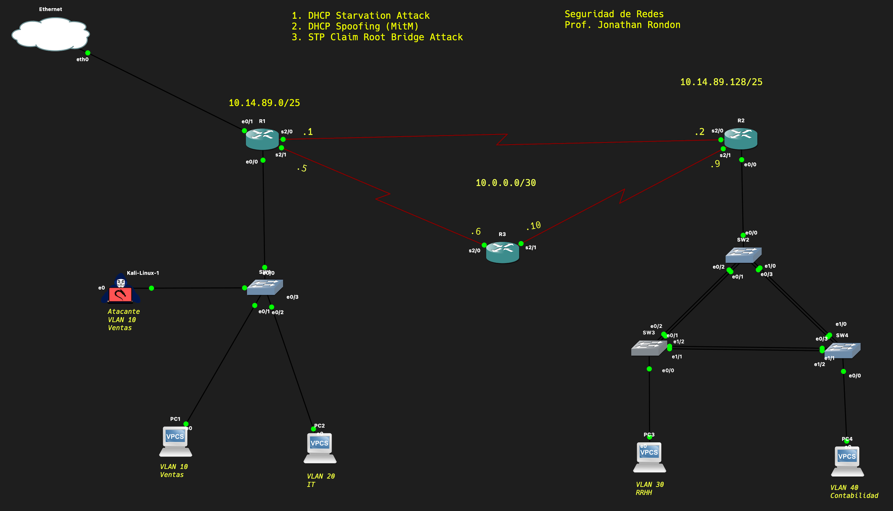

# DHCP Starvation Attack

> 📚 **Asignatura:** Seguridad de Redes  
> 👨‍🏫 **Profesor:** Jonathan Rondón  
> 🏫 **Instituto Tecnológico de Las Américas (ITLA)**  
> 👤 **Autor:** Branyel Pérez

⚠️ **USO EXCLUSIVO EN ENTORNOS DE LABORATORIO CONTROLADOS.** El uso indebido de estas herramientas fuera de ambientes autorizados es ilegal y contrario a la ética profesional.

---

## Tabla de Contenidos

1. [Descripción del Ataque](#descripción-del-ataque)
2. [Topología de Red](#topología-de-red)
3. [Especificaciones Técnicas](#especificaciones-técnicas)
4. [Requisitos](#requisitos)
5. [Guía de Ejecución](#guía-de-ejecución)
6. [Verificación del Ataque](#verificación-del-ataque)
7. [Análisis Técnico](#análisis-técnico)

---

## Descripción del Ataque

El ataque **DHCP Starvation** es una técnica de Denegación de Servicio (DoS) que tiene como objetivo agotar el pool de direcciones IP de un servidor DHCP legítimo.

### Objetivo
Enviar múltiples solicitudes DHCP DISCOVER con direcciones MAC aleatorias para consumir todas las direcciones IP disponibles en el servidor DHCP, impidiendo que clientes legítimos obtengan configuración de red.

### Vector de Ataque
Inundación de paquetes DHCP DISCOVER con direcciones MAC generadas aleatoriamente desde la máquina atacante hacia el servidor DHCP de la red.

---

## Topología de Red



---

## Especificaciones Técnicas

### Direccionamiento

| Segmento | Red | Máscara |
|----------|-----|---------|
| LAN Sede A | 10.14.89.0/25 | 255.255.255.128 |
| LAN Sede B | 10.14.89.128/25 | 255.255.255.128 |
| VLAN 30 (RRHH) | 10.14.89.192/27 | 255.255.255.224 |
| VLAN 40 (Contabilidad) | 10.14.89.224/27 | 255.255.255.224 |
| Backbone Serial | 10.0.0.0/30, 10.0.0.4/30, 10.0.0.8/30 | 255.255.255.252 |

### Actores del Laboratorio

| Rol | Equipo | Dirección IP | Interfaz/Puerto |
|-----|--------|--------------|-----------------|
| Atacante | Kali Linux | 10.14.89.4 | eth0 → SW1 (e0/3) |
| Víctima | PC1 | 10.14.89.2 | VLAN 10 |
| Servidor DHCP | Router R1 | 10.14.89.1 | Gateway legítimo |

### Infraestructura

- **Routing:** OSPF Área 0 entre R1, R2 y R3
- **Switching Sede B:** SW2, SW3, SW4 en topología triangular
- **Protocolos L2:** EtherChannel + PVST+

---

## Requisitos

### Software
- Python 3.x
- Scapy

### Instalación de Dependencias
```bash
pip install scapy
```

### Permisos
- Privilegios de superusuario (root)

---

## Guía de Ejecución

### Paso 1: Identificar la Interfaz de Red
```bash
ip addr show
```
Identificar la interfaz conectada a la red objetivo (ejemplo: `eth0`).

### Paso 2: Ejecutar el Ataque
```bash
sudo python3 DHCP_Starvation_Attack.py -i eth0 -n 200 -t 0.05
```

### Parámetros del Script

| Parámetro | Descripción | Valor Default |
|-----------|-------------|---------------|
| `-i`, `--interface` | Interfaz de red a utilizar | **Requerido** |
| `-n`, `--number` | Cantidad de paquetes DISCOVER | 200 |
| `-t`, `--time` | Intervalo entre paquetes (segundos) | 0.05 |

### Ejemplo de Salida
```
[21:30:45] INFO: Iniciando carga DHCP en eth0
[21:30:45] INFO: Meta: 200 solicitudes | Intervalo: 0.05s
[+] Enviados: 200/200
[21:30:55] INFO: Proceso finalizado. Verifica el 'show ip dhcp binding' en el router.
```

---

## Verificación del Ataque

### En el Router R1 (Servidor DHCP)
```
R1# show ip dhcp binding
```

### Resultado Esperado
El pool de direcciones DHCP estará ocupado por múltiples entradas con direcciones MAC aleatorias que comienzan con `02:xx:xx:xx:xx:xx`.

```
Bindings from all pools not associated with VRF:
IP address      Client-ID/              Lease expiration        Type
                Hardware address/
                User name
10.14.89.5      02ab.3c4d.5e6f          Feb 12 2026 09:30 PM    Automatic
10.14.89.6      02cd.ef12.3456          Feb 12 2026 09:30 PM    Automatic
10.14.89.7      0212.3456.789a          Feb 12 2026 09:30 PM    Automatic
...
```

---

## Análisis Técnico

### Estructura del Paquete

```
Ethernet Frame
├── Source MAC: [MAC Aleatoria 02:xx:xx:xx:xx:xx]
├── Destination MAC: ff:ff:ff:ff:ff:ff (Broadcast)
│
└── IP Packet
    ├── Source IP: 0.0.0.0
    ├── Destination IP: 255.255.255.255
    │
    └── UDP Segment
        ├── Source Port: 68 (DHCP Client)
        ├── Destination Port: 67 (DHCP Server)
        │
        └── BOOTP/DHCP
            ├── Message Type: DISCOVER
            ├── Transaction ID: [Aleatorio]
            └── Client Hardware Address: [MAC Aleatoria]
```

### Flujo del Ataque

1. El script genera una dirección MAC unicast aleatoria
2. Construye un paquete DHCP DISCOVER con esa MAC
3. Envía el paquete en broadcast a la red
4. El servidor DHCP reserva una IP para esa MAC
5. Se repite el proceso hasta agotar el pool

### Indicadores de Compromiso (IoC)

- Múltiples solicitudes DHCP desde MACs con prefijo `02:xx`
- Alto volumen de tráfico UDP puertos 67/68
- Pool DHCP agotado en poco tiempo

---

## Evidencias del Laboratorio

### 1. Estado Inicial - Antes del Ataque
Pool DHCP del router R1 con direcciones disponibles.


### 2. Ejecución del Ataque
Script enviando solicitudes DHCP DISCOVER masivas con MACs aleatorias.


### 3. Resultado - Después del Ataque
Pool DHCP completamente agotado. El router no puede asignar más direcciones IP.


---

## Archivos del Repositorio

| Archivo | Descripción |
|---------|-------------|
| `DHCP_Starvation_Attack.py` | Script principal del ataque |
| `Topologia.png` | Diagrama de la topología de red |
| `Antes del ataque DHCP Starvation.png` | Estado inicial del pool DHCP |
| `Ejecutando el ataque DHCP Starvation.png` | Ejecución del script |
| `Después del ataque DHCP Starvation.png` | Pool agotado |
| `README.md` | Documentación técnica |

---

## Referencias

- RFC 2131 - Dynamic Host Configuration Protocol
- Documentación oficial de Scapy

---

**Disclaimer:** Este material es parte de un ejercicio académico supervisado. El autor no se responsabiliza por el uso indebido de este código.
